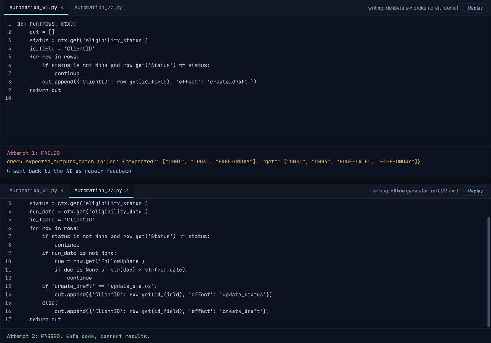
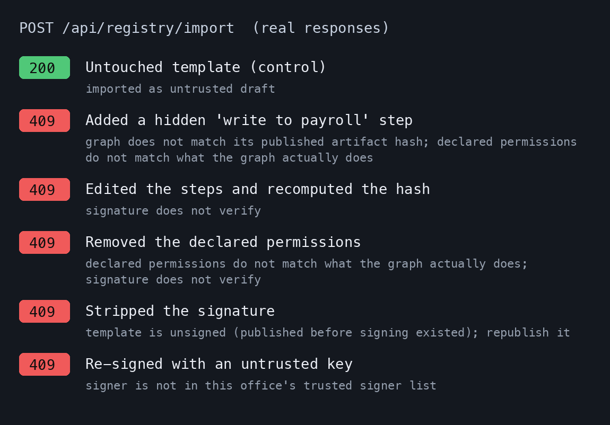

# AutoStack

> **NOVA 2026 · BITS Pilani Dubai · Track C (AI Engineering) · Theme: Open Innovation · Team Activation**
>
> **AutoStack finds the work your office repeats, writes the automation code for it, tests that code in a sandbox and repairs it until it passes, dry-runs it on your data, and puts it live only after a person approves.**

**Demo video:** [Google Drive](https://drive.google.com/file/d/1LydXr6ZuxiZvZcZXRW4YEmrSyX3QOylo/view?usp=sharing) · **Live app:** [activation-frontend-production.up.railway.app](https://activation-frontend-production.up.railway.app/) · **Repository:** [github.com/Shreeya1-pixel/ACTIVATION](https://github.com/Shreeya1-pixel/ACTIVATION)

**The problem:** 64% of UAE SMEs run core operations on Excel (Fortis, April 2026), and staff repeat the same edits every week. Automation tools expect someone to know what to automate and how to build it safely. Small offices usually have no such person.

| At a glance | |
|---|---|
| The loop | **Identify → Generate → Test & self-repair → Approve → Dry run → Go live**, in one app |
| Live proof, no sample data | **Try it live:** edit a sheet, and AutoStack identifies your routine, writes and repairs the code, tests it on a copy of *your* sheet, dry-runs it and runs it, with undo |
| Detection accuracy | Precision / recall **1.00 / 1.00** on 500 synthetic workspaces; **0.97 / 0.999** with 15% of steps interrupted (0.81 / 0.93 without our stitching step) |
| Does the test really catch bad code? | Of 50 deliberately broken programs, the independent oracle catches **47**; a safety check alone catches 11, a sandbox run without expected results 18 |
| Sandbox | **29 of 30** attack attempts blocked (network, files, processes, escape tricks); tampered shared templates are refused (**409**) |
| Tests | **216 pass**, 2 skipped, 29 subtests; plus 250 live-stack checks (54 end-to-end, 31 scenarios, 165 authorization) |
| Real-world grounding | Our hand-built automations (not AutoStack itself) are used by TÜV Rheinland staff in Dubai: 20 certificate invoices in 5 minutes instead of 1–2 hours for 2–3 people |
| Footprint | Runs on the office PC: under 100 MiB RAM, 0.47% idle CPU (measured on Windows); no API key needed |

## Quick start (about 5 minutes)

Needs Python 3.11+ and Node.js 18+.

```bash
git clone https://github.com/Shreeya1-pixel/ACTIVATION.git && cd ACTIVATION
python -m venv .venv && .venv/bin/pip install -r requirements.txt   # Windows: .venv\Scripts\pip
cd frontend && npm install && cd ..

.venv/bin/python scripts/run_worker.py     # terminal 1: API on :8747
cd frontend && npm run dev                 # terminal 2: UI on http://localhost:5173
```

Open http://localhost:5173, register (the first user becomes owner), then **Product → Try it live**:

1. **Start practice workspace:** a real folder with one invoice sheet. Edit it in the page or with **Open in Excel**.
2. **Do the routine on 3 invoices:** set *Status* to *Approved* and *Checked By* to your initials, then *Payment Requested* to *Yes*, then click **Done**.
3. **Identified:** a card shows the routine AutoStack found, and the rows it saw it on.
4. **⚡ Automate this:** watch the files being written, the code, and the sandbox test on a copy of your sheet. Tick *broken draft* to watch the AI repair a failing first version.
5. **Approve**, read `dry_run.diff` (nothing written yet), then **Go live**. **Undo this run** puts the rows back.

There is also a sample workspace (`scripts/load_demo.py`) with messy invented UAE data; see [docs/setup.md](docs/setup.md).

## What makes it different

Task-mining tools detect; code assistants generate. AutoStack closes the loop: what it detects becomes the specification, the expected results are derived from that specification independently of the generated code, and nothing runs until the code matches them.

- **It tells you what to automate.** ChatGPT and Copilot write code only once you describe the task, and task-mining tools stop at a report. AutoStack goes from what you did to a tested automation.
- **It proves the code before trusting it.** Generated code is tested against an independent check built from the confirmed plan, on a copy of your own sheet. Failures go back to the AI, which repairs its code (up to 3 attempts).
- **A person stays accountable.** Approval is bound to the exact code (SHA-256) and its passing test, and every run can be undone and appears in a tamper-evident log.
- **Safe to share between offices.** Automations travel as Ed25519-signed, scoped, revocable templates that must pass the sandbox again on the receiving machine.
- **Private by default.** Raw data stays on the PC; personal data is masked before any AI call, or nothing leaves at all in offline mode.

Related work (Flash Fill, RPA recorders, task mining) and the full comparison table: [docs/comparison.md](docs/comparison.md).

## Impact

A member of Team Activation hand-built 8 automations that TÜV Rheinland staff in Dubai use today on internal portals: 20 certificate invoices in 5 minutes (by hand, 1–2 hours for 2–3 people), and shipment certificates in 5–7 minutes instead of 2–3 hours, which is about 40–60 hours a month at 20 a month. Each tool needed a developer for weeks. AutoStack exists so the next office doesn't.

> "I would use it. It feels like it would save us a lot of time."
> **Technical Officer (Conformity Assessment Engineer), TÜV Rheinland Middle East**, after seeing AutoStack (one of 5 office and factory workers who gave early feedback, September 2026)
>
> "We use Excel for a lot of our work, so this would save us time."
> **Resident Engineer, ACE International Consulting Engineers, Dubai**

Savings maths, viability and the adoption path: [docs/impact.md](docs/impact.md).

## Done vs not yet

**Done and tested:** detection on any CSV/Excel folder; rule learned from your own edits; AI code generation with self-repair (Gemini or offline); sandbox tests on a copy of your sheet; dry run, approval, live run, rollback; signed registry; 4-role access control; PII masking; hash-chained audit log.

**Not yet:** writing back to `.xlsx` (CSV today) and rules with more than one condition (by 14 Nov); browser capture is a prototype; no pilots yet (planned Dec to Feb, starting with the TÜV teams). Details: [docs/scope.md](docs/scope.md).

**Known limits:** detection accuracy is measured on synthetic workspaces, and the loop is tested on sample and practice sheets; there are no real-office pilots of AutoStack yet. The oracle checks which rows are selected, not the effect label, so a program that selects the right rows but does the wrong action passes it. On macOS the sandbox cannot cap memory (a memory bomb is the one attack of 30 not blocked there).

## Testing

```bash
.venv/bin/python -m pytest tests/ -q     # 216 passed, 2 skipped, 29 subtests
.venv/bin/python scripts/oracle_ablation.py        # 50 broken programs: static 11, sandbox 18, oracle 47
.venv/bin/python scripts/sandbox_attacks.py        # 30 attacks: 29 blocked
.venv/bin/python scripts/registry_tamper_demo.py   # 5 tampered templates: all refused with 409
```

| Self-repair: attempt 1 is caught, attempt 2 passes | Tampered shared templates are refused |
|---|---|
|  |  |

Benchmark, live-stack suites and what each covers: [docs/testing.md](docs/testing.md).

## More documentation

| Doc | What's in it |
|---|---|
| [docs/architecture.md](docs/architecture.md) | Architecture diagram, the loop step by step, how each part is built, detection benchmark and ablation, stack, roles, registry, PII |
| [docs/comparison.md](docs/comparison.md) | What makes it different, related work, feature comparison |
| [docs/impact.md](docs/impact.md) | Evidence, TÜV case, savings maths, viability, adoption path |
| [docs/setup.md](docs/setup.md) | Full quick start, sample workspace, configuration, repository layout, Railway deployment |
| [docs/testing.md](docs/testing.md) | All test suites and results |
| [docs/scope.md](docs/scope.md) | Done vs next in detail, roadmap |
| [docs/contracts.md](docs/contracts.md) | Event, plan and artifact contracts |

## Team and licence

**Team Activation**, NOVA 2026, BITS Pilani Dubai, Track C: AI Engineering. Submitted to NOVA 2026; all rights reserved by Team Activation.
