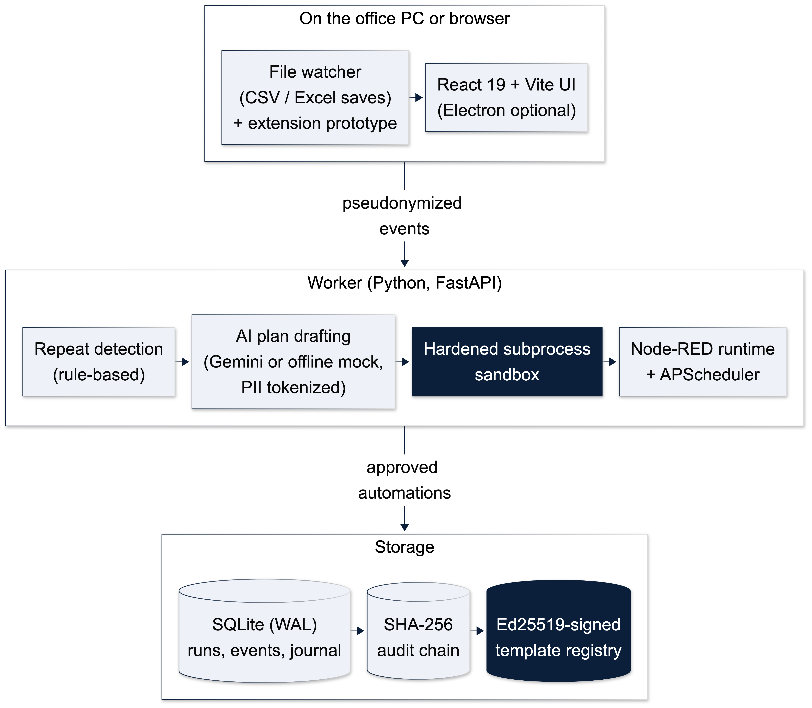

# How AutoStack works



## The loop, step by step

AutoStack closes the whole loop, from noticing the work to running it safely:

```
 1. IDENTIFY          2. GENERATE           3. TEST & REPAIR     4. DRY RUN            5. GO LIVE
 Watch the sheets  →  AI writes the     →  Static checks +   →  Preview every row  →  Approved runs on a
 you already use,     automation code      sandboxed run;       it would change,      schedule, file change
 find repeated        from the detected    failures go back     change nothing        or webhook, fully
 edit sequences       pattern              to the AI to fix                           audited, reversible
                                          └── a person approves the tested code before steps 4 and 5 ──┘
```

| Step | What happens | How it is built | Proof in the repo |
|---|---|---|---|
| **1. Identify** | Point AutoStack at any folder of CSV or Excel files. It compares every save row by row and finds the same ordered edits repeated **3+ times across 2+ records**. Reformatting a date or amount is ignored. Routines interrupted by a coffee break are stitched back together. | Per-record instances with a 10-minute gap rule, 45-minute stitching when the joined routine itself repeats, fragment folding, value normalisation; you pick the ID column and the columns that matter | `backend/detection/sequences.py`; benchmark precision/recall 1.00 on clean data; sample replay detects 2 real patterns and rejects 2 near-misses; **Try it live** detects a routine from your own edits |
| **2. Generate** | AutoStack reads the sheet to learn the rule from the rows you finished (which column marks the work as waiting, and which values every finished row ends with), shows it in plain words for you to confirm, then AI turns it into runnable Python code (`run(rows, ctx)`). Every file is written to disk (`plan.json`, `automation_vN.py`). Personal data is tokenised before any external AI call. | Gemini or a deterministic offline mock; plan validation; code hashed with SHA-256 | `backend/engine/generation.py`, `backend/engine/ai.py` |
| **3. Test & self-repair** | The generated code is statically checked (allowlist, banned constructs, size cap), then executed in a hardened sandbox **on a copy of the sheet being automated** (plus plan-derived edge-case rows) and compared with an independent oracle computed from the plan. **Any failure (forbidden import, crash, wrong rows) is turned into specific feedback and sent back to the AI, which rewrites the code: up to 3 attempts.** Every attempt is kept and audited; superseded or failing versions can never be tested or activated. | Fresh subprocess, sockets blocked, builtins stripped, CPU and memory limits, wall-clock kill; `generate_with_repair` loop | `backend/engine/generation.py`, `backend/engine/runner.py`; 10 self-repair tests |
| **4. Dry run** | Before a live run, preview exactly which rows would be updated and which messages drafted. **Nothing is written.** A preflight check also confirms every file and column the automation needs still exists. | `dry_run: true` on runs; preflight on every run | Before/after `dry_run.diff` on Try it live; *Dry run* button on the Workflows page; `test_dry_run_computes_but_does_not_apply`; 4 preflight tests |
| **5. Go live** | Only after a person approves that exact code and its passing test does it run, on a schedule, a file change, a webhook or on demand. | Exactly-once journal, idempotent steps, cancel and rollback (multi-column), SHA-256 hash-chained audit log | `test_practice_end_to_end`; 31/31 scenario battery; *Verify chain* on the Trust Log page |

**Why this matters:** each step catches a different failure. Identification keeps you from automating noise. The sandbox catches broken code, and self-repair fixes it without a developer. The dry run catches "right code, wrong rows". Approval keeps a person accountable. The audit log proves what happened afterwards.

## How each part is built

| Area | Implementation | Evidence |
|---|---|---|
| Detection | Per-record instances with a 10-minute gap split, 45-minute stitching of interrupted routines (only when the joined routine itself meets the rule), fragment folding. Trailing open instances are not counted. Needs 3+ occurrences across 2+ records. Step labels include the changed fields | `backend/detection/sequences.py`, benchmark below, 6 quality tests |
| Rule learning | From an identified routine, reads the sheet: the columns the routine changed, the value every finished row ends with, and the value the waiting rows still have. Values that could escape a rule (quotes, `;`, `{}`) are refused. Multi-column updates, each exactly-once and reversible | `backend/practice.py`, `backend/engine/graph_build.py`, `tests/spike/test_practice_end_to_end.py` |
| Self-repairing generation | Static and sandbox failures converted to model-readable feedback (`report_problems`), previous code and feedback sent back, capped at 3 attempts, every version preserved, audited and written to disk. The self-check adds boundary rows from the plan (due one day after the cut-off, due on it) so a missing rule cannot pass | `backend/engine/generation.py`, 10 tests |
| Capture | Any ID column with a duplicate-ID check. Per-file column selection. CSV and XLSX (zip-bomb checked). Configurable folder, with system and home roots blocked | `backend/capture/`, 12 tests |
| Sandbox | Static allowlist, banned constructs, 20 KB cap. Fresh subprocess with sockets blocked, builtins stripped, rlimits probed per OS, wall-clock kill | `backend/engine/runner.py` |
| Reliability | Exactly-once journal, idempotent steps, dry run, cancel, rollback. Preflight check before any effect | `backend/engine/`, scenario battery 31/31 |
| Security | PBKDF2 (200k iterations), hashed bearer tokens, login lockout. 4-role RBAC enforced on every route. Constant-time webhook secrets, rate limits | authz matrix 165/165 |
| Audit | SHA-256 hash chain, `GET /api/audit?verify=1`, SIEM stream, compliance bundle | Trust Log page |
| Registry | Ed25519 signatures over a manifest (graph SHA-256, scopes, connectors). Trusted-signer list. 409 on tamper, 403 on missing scopes, revocation | `backend/security/signing.py`, 8 tests |
| PII | Tokenised before Gemini. Keyed HMAC pseudonyms in the event log. Detects Emirates ID, UAE TRN, IBAN, UAE mobile numbers, email, plus common tax and national ID formats | `backend/security/pii.py` |

## Detection benchmark

`python scripts/benchmark_detection.py` builds 500 synthetic workspaces with known answers: real routines, near-misses (repeated only twice, or only ever on one record), one-off noise edits, several records worked on the same day, and events arriving out of order. It then scores the detector. Results are saved to `docs/detection-benchmark.json`.

| Scenario | Planted patterns | Near-misses | Precision | Recall | False alarms |
|---|---|---|---|---|---|
| Clean timing | 982 | 983 | **1.00** | **1.00** | 0 |
| 5% of steps interrupted (11–25 min pause) | 980 | 1,000 | **1.00** | **1.00** | 0 |
| 15% of steps interrupted | 988 | 1,015 | **0.97** | **0.999** | 30 |

**Ablation:** on the same 500 workspaces with stitching switched off, the 15% scenario scores precision **0.81** and recall **0.93** with **212** false alarms, because interrupted routines split into fragments that look like patterns. With stitching: **0.97 / 0.999** and 30 false alarms. At 5% interrupted it is 0.996 / 0.996 without stitching and 1.00 / 1.00 with it. (Re-run 30 Sep 2026.) Speed: about 3–4 ms per 1,000 events. This measures the implementation against its rule under messy timing; accuracy on a specific office's data will depend on how that office works.

## Architecture and stack

```
Browser (React 19 + Vite, :5173)
   │  bearer token, live polling
   ▼
Worker (FastAPI, :8747) ──► SQLite (WAL): workflows, runs, events, candidates, audit chain
   │  capture → detect → plan → generate → sandbox → approve → run
   ▼
Node-RED (optional, :18790) ──► calls back per step (read-due / update-row / draft-create / notify)
```

| Layer | Technology |
|---|---|
| Frontend | React 19, Vite, CSS design tokens, Motion |
| Backend | Python 3.11+, FastAPI, SQLAlchemy 2, SQLite (WAL), APScheduler |
| Files | csv, openpyxl (read-only, `data_only`, zip-bomb checked) |
| AI | Google Gemini (optional) or deterministic offline mock |
| Security | PBKDF2-HMAC, hashed tokens, subprocess sandbox, SHA-256 audit chain, Ed25519 (`cryptography`), PII tokenisation |
| Desktop | Electron shell (optional) |

## Roles

| Role | Can |
|---|---|
| Observer | Read |
| Operator | Run workflows, stage events, load sample data |
| Approver | Sandbox-test and activate automations |
| Owner | Publish to the registry, change the capture folder, manage members and triggers |

The first registered user becomes owner; later users join as operators.

## Registry supply chain

- **Signed:** each version carries an Ed25519 signature over its slug, version, title, graph SHA-256, connectors and scopes. The office key is a 0600 file in the data directory.
- **Tamper-evident:** on import the hash, scopes and signature are re-verified. Any mismatch returns 409 and is audited as `registry.import_refused`.
- **Scoped:** scopes (`read-content`, `write-target`, `draft-create`, `notify`, `connector`) come from the node catalog. An import is refused (403) unless every scope is granted.
- **Trusted signers:** this office's key plus keys listed in `AUTOSTACK_TRUSTED_SIGNERS`.
- **Untrusted by default:** imports arrive as drafts that must pass local sandbox tests and approval.
- **Withdraw vs revoke:** withdrawing stops new installs. Revoking (reason required) also marks installed copies revoked and blocks their run reports.

## PII handling

- **External AI:** names, emails, phones, addresses, Emirates IDs, TRNs, IBANs and other ID fields become `⟦P1⟧`-style tokens before a Gemini call and are restored locally.
- **Event log:** identifiers in record keys are stored as keyed pseudonyms such as `[EMAIL:1a2b3c4d]`, so detection can still tell records apart without storing the value.

[← Back to README](../README.md)
